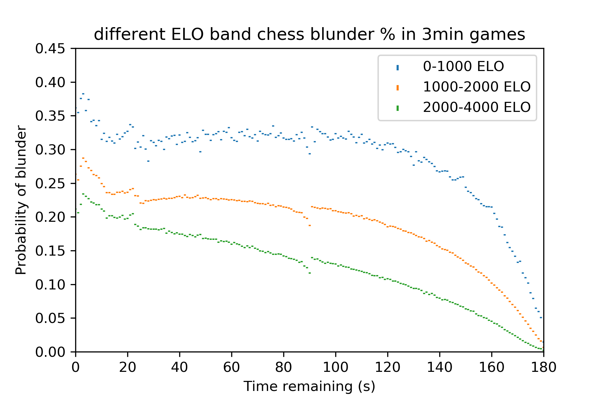
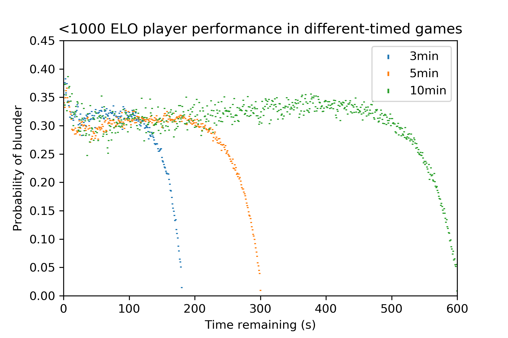
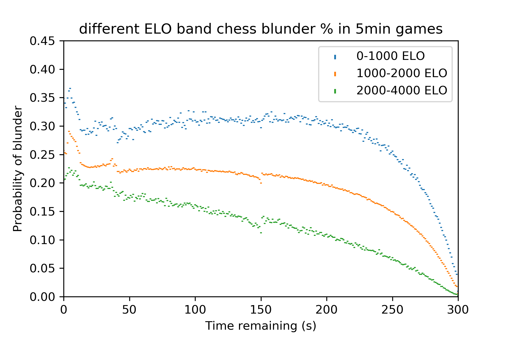
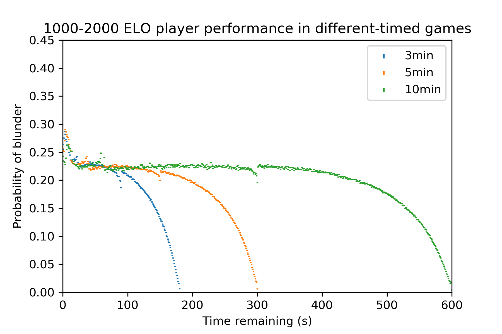
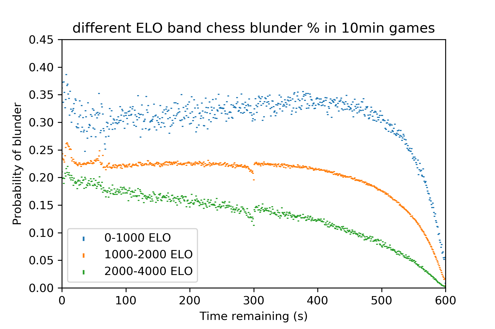
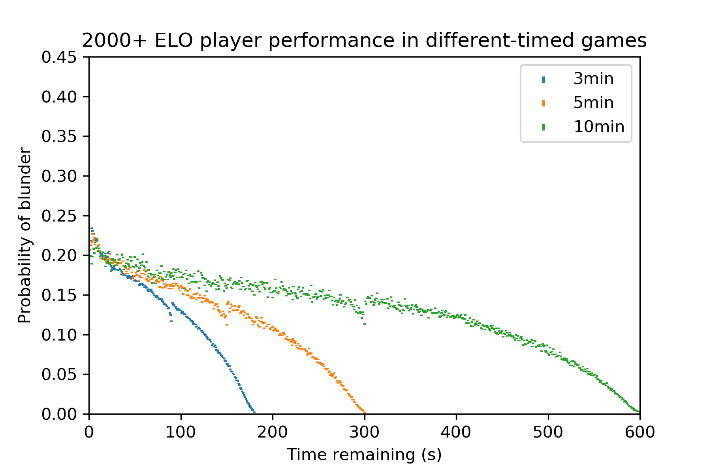

# chess-blunders
Examining blunder rates in 68 million games of online chess and confirming my suspicion that the lichess "low time" alarm sound really does make people play worse.
|Sample graph:|
|:---:|
||

What is it?
----
This is a series of graphs that illustrate the incidence of blunders (major unforced errors) in games of online chess for different ELO ratings and time controls.
The y axis is the normalised blunder chance - the total number of blunders over the total number of all moves, and the x-axis is the time remaining (in seconds)

Results
---
|By time (All ELOs)|By ELO (All times)|
|:---:|:---:|
|| |
|| |
|| |

|Legend | Matching games analysed (3min)| Matching games analysed (5min)| Matching games analysed (10min)|
|:---:|:---:|:---:|:---:|
|<1k ELO|21,762| 56,787 | 26,232 |
|1-2k ELO |704,164| 905,794 | 870,375 |
|>2k ELO |230,211| 80,071 | 77,829 |

Some interesting things to discuss here, mostly about the left-hand-graphs.
 - There is a noticeable "bump" at the 20s mark for 3min games and the 40s mark for 5min games - this is the exact same time the lichess website plays a loud alarm beeping sound and flashes the clock red to warn you you are low on time. I hypothesise this interuption can panic players and cause them to play knee-jerk, illconsidered moves, resulting in a bump in the blunder rates (since I know that I do the same!).
 - As expected, generally speaking, the blunder rate increases with time, with very few players blundering in the opening stages and most blunders occuring in the last few seconds of a game as the time situation becomes desperate.
 - It is interesting to note the blunder rate plateaus for <1k and 1-2k elo players, but in fact does not plateau for expert players (>2k elo, top 10% of userbase). My hypothesis for this is that beginner players generally gain little advantage from extra time - if they havent found the best move in 20 seconds, they probably wont find it in 20 minutes either. However, expert players probably could play an (almost) blunder-free game if they spent an hour carefully considering any move - they are the only demographic which is actually suffering from time pressure throughout the entire match, not just in the final stages. An alternate hypothesis could be that expert players ration their time more ruthlessly and strategically.
 - There is a small dip in blunder-rates at 50% of starting time for all time controls and ELOs. This puzzled me at first, until I realised what it was - on lichess.org online tourneys, one can choose to "go beserk" and gamble half their time for double the rating points if they manage to win anyway. These "beserkers" are playing their first few moves at the 50% of time remaining mark, and although their numbers are small, this is enough to slightly drag down the average blunder rate at this point. [Description of the Beserk mechanic here](https://lichess.org/tournament/help?system=arena)
 
*Fun (unrigorous) deduction*

From my data, I hypothesize that a suitable handicap to enable a 1000-2000 ELO player to compete with a 2000+ ELO player fairly would be the following time control:
|**2k+ player:**|3 seconds +3s increment|
|**1-2k player:**|unlimited time|

This would mean that the expert player would always have about 3 seconds on the clock, which corresponds to the region of the graph where the expert's error rate approaches the average plateaued error of the intermediate player.
Of course, this logic is riddled with flawed assumptions, but it is just a bit of fun.
 
 
How does it work?
----

I downloaded 68 million games of online chess from the lichess database: [https://database.lichess.org/](https://database.lichess.org/)
I wrote a program to go through these games and filter them for various parameters (ELO, time controls, etc) and also only select those games with clock and eval data (about 25% of them). From these I analysed the change in eval with every move, and the time at which that move was taken.

I defined a blunder the same way the lichess.org website does - a blunder is a move that results in a 200 [centipawn eval loss](https://en.wikipedia.org/wiki/Chess_piece_relative_value) according to the computer. There is a slight complication, which is that if you were already winning the game before your blunder, and you are still winning the game after your blunder, then the blunder doesnt count. This is the same method lichess uses.

The main interesting challenge here was handling such enormous volumes of data. A naive readlines() approach to reading in the raw data would require 140GB of text to be stored in memory - not exactly feasible! So instead I wrote a preprocessing step whereby all unnessary information is stripped out (metadata, actual moves, etc), reducing the initial 140GB datafile by a proportion of about 0.0000093, resulting in much more manageable 1.3KB datafiles that could be used. Another advantage of this is speed - it takes 40 minutes just to read every line of the initial file, so by preprocessing it into a new file, I only ever have to do that costly initial read step once, and in future can plot/analyse data instead from the 1.3KB reduced file.

Matplotlib is used for plotting.

Limitations/Where do I go from here?
----

1. Datapoints
Because of the vast quantities of games being analysed, I had to rely on lichess games which had already been evaluated by a computer. This comprises only about 2-5% of the games on the database. The size of my sample pool was then further reduced with my time control and ELO filters, resulting in occaisionally surprisingly sparse datasets considering the 68 million (!) games that are considered at the beginning.

The way to fix this would either be to implement my own eval (and wait multiple days for each run of the program to finish) or just to take in even more lichess data. I only used the data from 1 month for this project - there are about 30 more months with clock and eval data available, so I could potentially increase my datapoints by a factor of 30 if I wanted to. However, this involves some not-inconsiderable busywork (each month is about 150GB and takes me ages to download and clear space for on my hard drive) so its not something I'm overly concerned about.

2. Beserk/time outliers
Beserk games (see https://lichess.org/tournament/help?system=arena ) create anomalous dips at the 50% mark. I could code up a check to spot and eliminate beserk games from the dataset. However, the beserk anomaly is not only minor, it is also interesting and perhaps does not merit a surgical removal. It has very little impact on the most interesting sections of the plot (the start and end of each game) so I view it as best left in. Some may disagree.

3. Speed
Various optimizations are possible, especially with the data serialization and plotting, which I scraped together in somewhat of a hurry. Using "eval" to rebuild dicts from text files is extremely bad practice generally speaking, and some sort of database rather than a crude textfile would be preferable.

4. Fitting/hypothesizing
I didn't do any mathematical fitting yet, or make hypotheses about other time controls and then test them with data. I just haven't had the time yet, since I am busy with exams.
